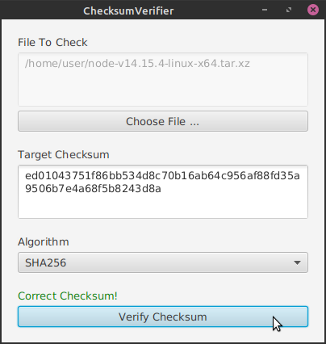

# ChecksumVerifier

## Introduction

This application lets the user compare the checksum of a selectable file with its target checksum inside a JavaFX GUI.
The available algorithms for computing the checksum are the following:

* MD5
* SHA1
* SHA256
* SHA512

## Screenshot

## Structure

As the entry point for this application a  separate `Start` class is used for making the JAR created with the Maven 
goal `package` work correctly.
This class only contains the main method and calls the _launch()_ method of the `App` class which
will initialize the actual application.

The application bases on the MVC pattern where the view is located in the directory
_src/main/resources/org.example.fxml_. 
Since there is only one model and controller class those classes are not described here in more detail.

The correct language bundle is chosen in the `initLanguage()` method inside the `App` class.
Currently, the GUI supports German and English.

## Build and start JAR

1. Execute the Maven goal `package`
2. The JAR file _.target/ChecksumVerifier-1.0-SNAPSHOT.jar_ includes all dependencies and can directly
   be started with a double click if Java 11 is installed on the device